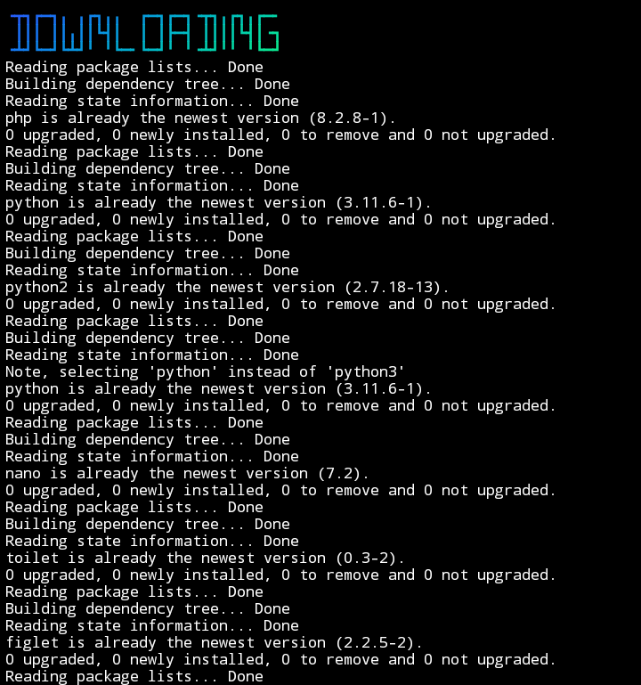

# all-pkg-termux


## introduction
This is a tool for installing all packages in Termux and is very useful for those of you who are just using Termux

## Instalations
```
$ pkg update && pkg upgrade
$ pkg install bash
$ pkg install python3
$ pkg install git
$ git clone https://github.com/Whomrx666/all-pkg-termux
$ cd all-pkg-termux
$ python3 install.py
```

## Instructions
- **for using**:Follow the installation method as above and the script will automatically install all packages in Termux
- **password**:You can fill in the new password that you will create there like registering

### Original Author
<a href="https://github.com/Whomrx666"></a>

Follow me: [Whatsapp](https://wa.me/6287855190571),[Youtube](https://youtube.com/@whomrx666),[Tiktok](https://www.tiktok.com/@whomr.x),[Facebook](https://www.facebook.com/whomrx.666),[Telegram](https://t.me/@Whomr_X),&[Website](https://whomrxhackers.blogspot.com/)

