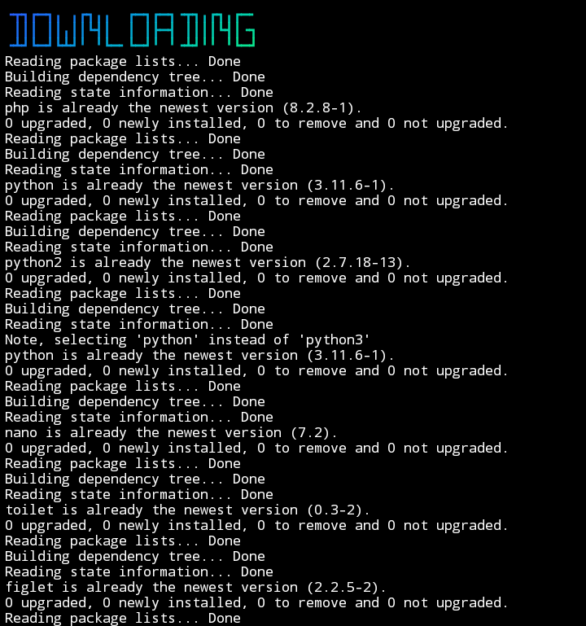

# all-pkg-termux


## introduction
This is a tool for installing all packages in Termux and is very useful for those of you who are just using Termux

## Instalations
```
$ pkg update && pkg upgrade
$ pkg install bash
$ pkg install python3
$ pkg install git
$ git clone https://github.com/Whomrx666/all-pkg-termux
$ cd all-pkg-termux
$ python3 install.py
```

## Instructions
- **for using**:Follow the installation method as above and the script will automatically install all packages in Termux
- **password**:You can fill in the new password that you will create there like registering

### Original Author
<a href="https://github.com/Whomrx666"></a>

## CONNECT WITH ME :

[](https://whomrxhackers.blogspot.com/)
[](https://twitter.com/whomrx666)
[](https://wa.me/6285926601133?text=Halo%2C%20Mr.X)
[](https://www.facebook.com/whomrx.666)
[](https://t.me/Whomr_X)
[](mailto:whomrx666@gmail.com)
[](https://www.tiktok.com/@whomr.x)

**If you want to donate, click on the button**
<a href="https://saweria.co/whomrx"></a>

---

<p align="left">
  
</p>

---

